<h1 style="display: flex; align-items: center; gap: 12px;">
  
  Rep8
</h1>

A pretty dumb, private by design, offline, workout tracker for iPhone and Apple Watch. No account, no subscription, no stranger feeds, no AI - just a tool to log your rep x set, weights, rest times and heart rate (if you have an Apple Watch)

Let your watch handle the rest timer and heart-rate capture without unlocking your phone. See your progress over time per exercise. Export in readable formats.

## Why?

- You already know the workouts you want to do. You don't want a coach in your pocket.
- There's no library of exercises to scroll through, and that's on purpose. Type in any name *incline bench*, *weird cable thing*, whatever you call it and start logging reps x sets.
- You don't want anyone else seeing how weak your knees felt today, or how tired you were on that last set.
- You don't need an AI telling you to *push harder* or *try 5 more reps*.
- You're a private human being. Your training is between you and the iron.

## What's in the box

- Add exercises and log sets with weight + reps in a single screen.
- Start a workout > Tap Rest > Log a Set > Start Next Session > Repeat Sets > Done.
- Apple Watch companion that runs the timer and records heart rate during sets. Keep your phone in the locker while you workout.
- Lock-screen Live Activity for the active session.
- Per-exercise progress chart with selectable metrics (top set weight, total volume, etc.).
- Optional heart rate during sets via Apple Watch. Toggle it off any time in Settings > Heart Rate.
- Optional diagnostic logs to help if something's broken. Only kept when you ask; logs never leaves your phone unless you tap Share.
- Export your workout history as JSON, CSV, or plain text. 

## Screenshots

### iPhone

  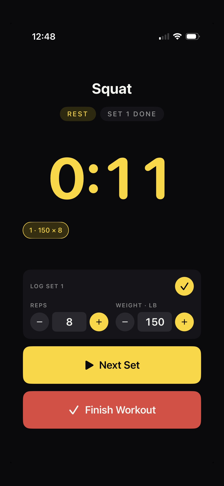
  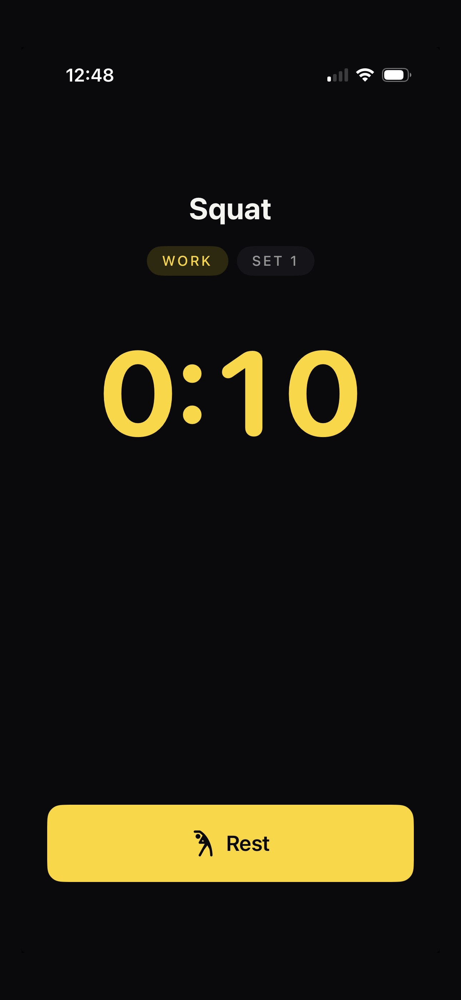
  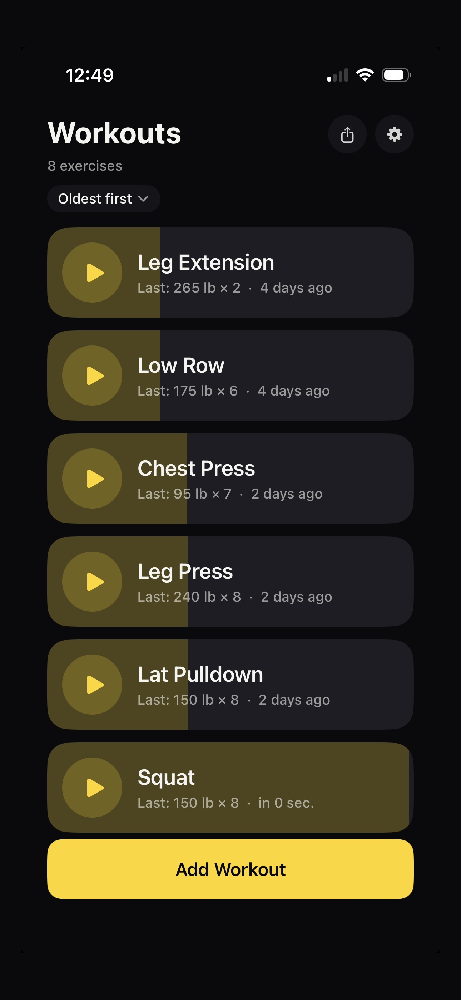
  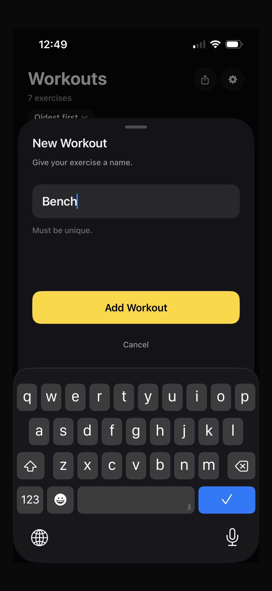
  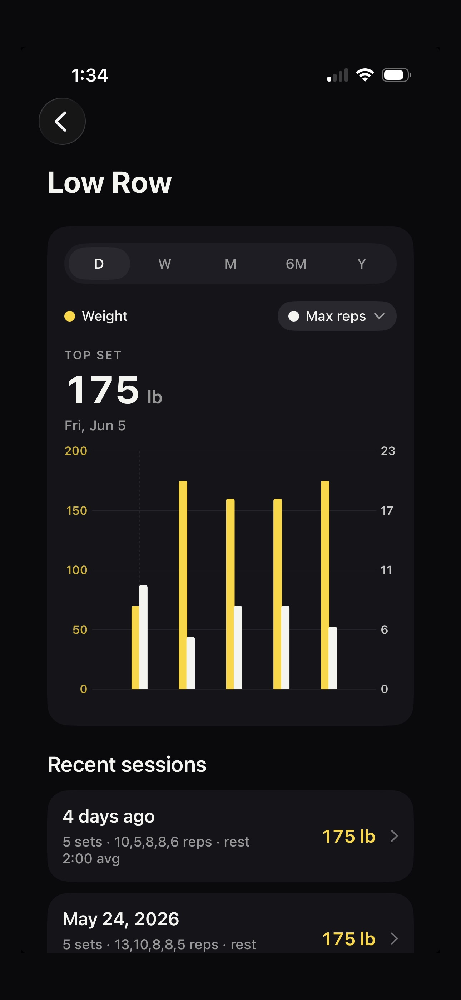
  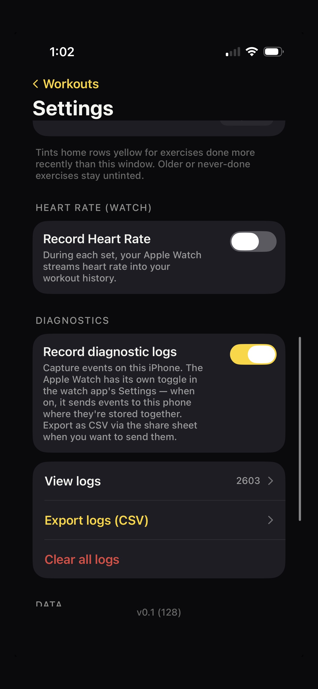
  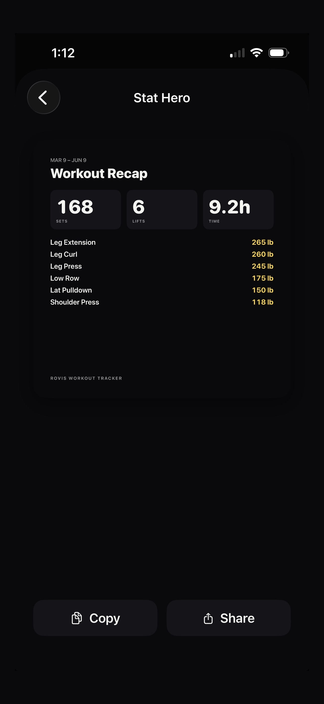
  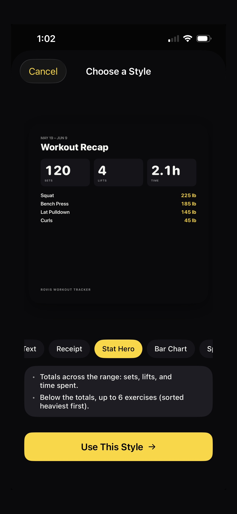
  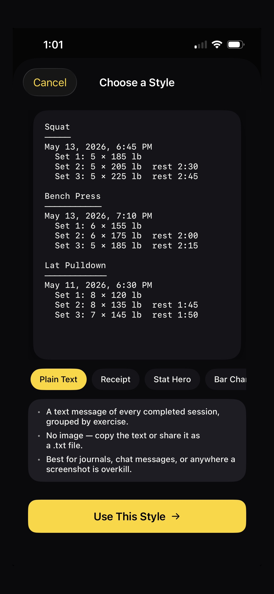

### Apple Watch

  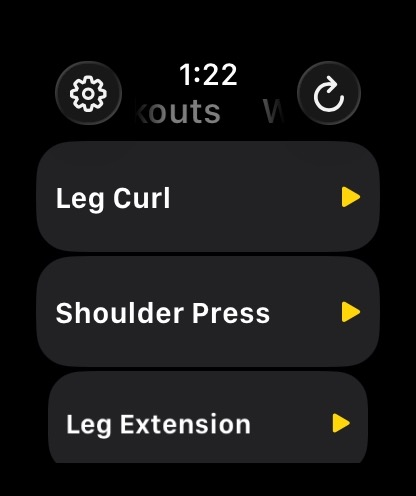
  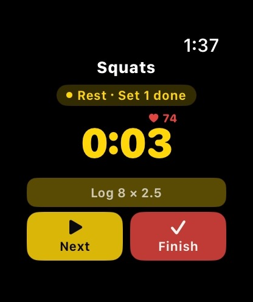
  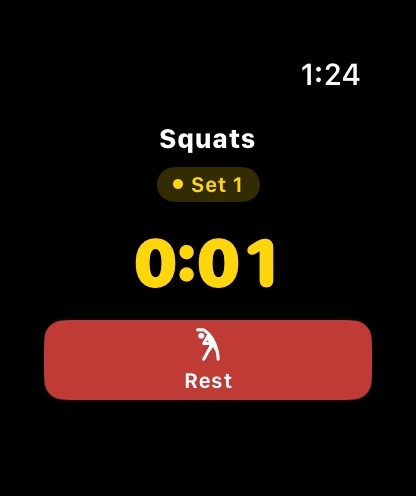
  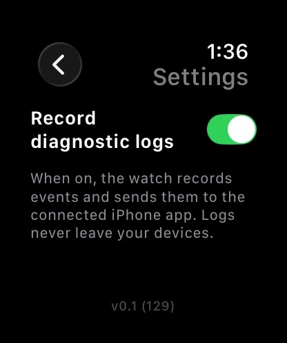

## Serious Privacy

### Stays on-device (private)

- All your workout data (exercises, sessions, sets) is stored under your own iCloud account, encrypted, and only accessible to your Apple ID. You can't see it from another account, and Apple can't read it. Same on the watch.
- Your app settings live in the same private iCloud space.
- Heart rate samples are pulled from Apple Health on the watch and stored in that same private space. They never leave your iCloud.
- Diagnostic logs (when you opt in) are stored locally on the device, and only handed from watch to phone over Apple's local phone-to-watch link. The app itself never transmits diagnostics anywhere. You have to manually tap "Export logs (CSV)" and share via the system share sheet to get them off-device.

### Shared between your own devices (phone <-> watch)

- Workout data syncs through your private iCloud space.
- Live workout state (current set, phase, snapshot, live heart rate) streams over Apple's local phone-to-watch radio, not the internet. This is the same channel iMessage and Apple Watch use; payloads never touch Apple's servers.

### Leaves the device only when you do it

- Share sheet exports - the three image card styles and Plain Text. Triggered only by tapping Share, and you pick the destination (Messages, Mail, Files, AirDrop, etc.). Nothing auto-uploads.
- Settings > Export as JSON/CSV/Plain Text works the same way: writes a temp file and hands it to the system share sheet. You choose where it goes.
- Diagnostic logs export uses the same opt-in share sheet flow.

### What is genuinely shared with anyone outside you

Nothing, unless you manually share it. There's no analytics SDK, no crash reporter sending to a third party, no telemetry endpoint. Your iCloud space is private, not public or shared.

### Caveats worth knowing

- iCloud requirement: if you aren't signed into iCloud, there's no cross-device sync. Data stays local on whichever device created it.
- Apple Health permission: heart rate is only collected if you grant access. Toggle off and the recorder stops.

## Links

- [Privacy Policy](privacy.html)
- [Support](support.html)
